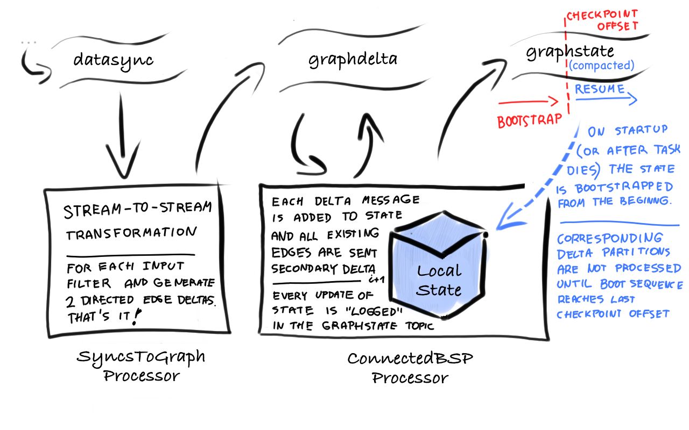

# VisualDNA GraphStream Project

### This is a prototype in two respects:

* Recursive stream processing framework which is included by source and as a project lives [here](https://github.com/michal-harish/donut)
* Streaming BSP equivalent of the Connected Components algorithm implemented in [VisualDNA Identity Graph](http://stash.visualdna.com/projects/DXP/repos/dxp-spark/browse)

### Contents

1. [GraphStream Pipeline Architecture](#architecture)
2. [Configuration](#configuration)
3. [Operations](#operations)
4. [Development](#development)

<a name="architecture">
## GraphStream Pipeline Architecture
</a>

The Graph Pipleine starts with syncs collected from Event Trackers or imported from partners and continues through GraphStream Application which processes and generates graph updates which are then off-loaded into HBase where there are mapped and available as Spark RDDs.

The GraphStream Application consists roughly of 3 stages each with one or more components:

1. **Ingest** - ingesting connections into the graph from various sources - two respective BSPMessage(s) are sent representing edge and reverse edge of the connection.

	- **SyncsToGraph** - this is a simple transformation of `datasync` topic to `graphdelta` delta topic 
    
   - **FileToGraph** - used to dump offline syncs into `graphdelta` topic

2. **Process** 

   - **ConnectedBSP** - this is a recursive operator which consumes (and recursively produces into) `graphdelta ` delta topic as well as publishes the new state into the `graphstate` commit log topic.

3. **Output**

   - **GraphToHBase** - this is an incremental compaction operator which consumes graphdelta topic, compacts the changes by the key into micro batches and loads into HBase table dxp-graph


While SyncsToGraph ahd GraphToHBase are simple stream-to-stream filter/map operators, the internal workings of ConnectedBSP requires a more detailed explanation. It also illustrates a general idea of local state in the realm of stream processing, and more specifically also *recurisve stateful stream processing*

First we need a different kind of topic - a commit log which is supported by Kafka fetaure called [Log  Compaction](https://cwiki.apache.org/confluence/display/KAFKA/Log+Compaction). A topic 'graphstate' in our architecture is log-compacted.




<a name="configuration">
## Configuration
</a>

Because the application is launched normally in the YARN cluster but *from a client machine*, in the application configuration (typially placed in **/etc/vdna/graphstream/config.properties**) you need `yarn1.site` parameter to point to your local hadoop-yarn configuration files, which in this example are expected to be in **/opt/envs/prod/etc/hadoop**. This configuration can be used on developer macs for launching from IntelliJ (see bleow) or Jenkins or other starting points.

```
#YARN 
yarn1.site=/opt/envs/prod/etc/hadoop
yarn1.classpath=/opt/scala/scala-library-2.11.5.jar:/opt/scala/kafka_2.11-0.8.2.1.jar:/usr/lib/hbase/*:/usr/lib/hbase/lib/htrace-core-3.1.0-incubating.jar:/usr/lib/hbase/lib/guava-12.0.1.jar:/usr/lib/hbase/lib/netty-all-4.0.23.Final.jar
yarn1.queue=developers
#J-PROFILER
#yarn1.env.LD_PRELOAD=/opt/jprofiler/librebind.so
#yarn1.env.REBIND_PORT=8849:0
#KAFKA 
zookeeper.connect=message-01.prod.visualdna.com,message-02.prod.visualdna.com,message-03.prod.visualdna.com
kafka.brokers=message-01.prod.visualdna.com:9092,message-02.prod.visualdna.com:9092,message-03.prod.visualdna.com:9092
#HBASE
hbase.site=/etc/hbase/conf.prod
```

NOTE: The `yarn1.classpath` means that we have already distributed large fat jars of scala-library and kafka so that we can have them here provided and distribute only a relatively thin jar each time we create a YARN launch context.

<a name="operations">
## Operations
</a>

### Packaging components and submitting them to YARN cluster
```
mvn clean package
```
The maven command above will generate an assembly jar for all components: `targets/SyncsToGraph-0.9.jar` and a `./submit` which can be used as follows:  

```
./submit net.imagini.dxp.graphstream.connectedbsp.ConnectedBSP /etc/vdna/graphstream/config.properties
```

OR

```
./submit net.imagini.dxp.graphstream.ingest.SyncsToGraph /etc/vdna/graphstream/config.properties
```

### YARN resources

The prototype was built on a modest cluster of **3 kafka brokers** with both `graphdelta` and `graphstate` topics having **32 partitions**.
When all 3 components, the application requires **310 GB of memory** across **76 YARN containers**. Most of the memory
is occupied byt the local state of the ConnectedBSP component, cca **256 GB** which covers enough to keep around 30 days of the connected graph state.


### Brokers configuration
For state topics we require log cleaner enabled on the brokers

```server.properties
log.cleaner.enable=true
```

### Creating normal topics with retention

```bash
./bin/kafka-topics.sh --zookeeper <zkconnect> --create --topic graphdelta --partitions 32 --replication-factor 2 --config cleanup.policy=delete --config retention.bytes=2147483648 
```

### Creating a compacted topic with some special behaviours
And then creating topic with compact cleanup policy
```bash
./bin/kafka-topics.sh --zookeeper <zkconnect> --create --topic graphstate --partitions 32 --replication-factor 1 --config cleanup.policy=compact --config min.cleanable.dirty.ratio=0.2 
```

Altering the topic to practically ignore the tombstone retention ..10 minutes from default 24 hours
```
./bin/kafka-topics.sh --zookeeper <zkconnect> --alter --topic graphstate --config delete.retention.ms=0
```

### Deleting topics

```bash
./bin/kafka-topics.sh --zookeeper <zkconnect> --delete --topic graphdelta
./bin/kafka-topics.sh --zookeeper <zkconnect> --delete --topic graphstate
```


<a name="development">
## Development
</a>
### Configuring IntelliJ and Maven 

The GraphStream project has a direct source dependencies which are not standard maven pom-declared dependencies
 but are pulled in as git submodules. This way it is possible rapidly develop the underlying Donut and Yarn1 frameworks
 which are still unstable. 

```
graphstream.git (stash.visualdna.com)
     |
     +-- donut.git  (github.com/michal-harish/donut)
            |
            +-- yarn1.git (github.com/michal-harish/yarn1)
```

So in order to be able to clone and initialise the codebase you'll need a github account and ssh keys of your
development machine to be added there. If you want to commit to the Donut or Yarn1 ask MH to add your ssh keys
to the projects. So after that you can clone the graphstream repo and initialise the submodules:

```
git clone git@stash.visualdna.com:7999/dxp/graphstream.git
cd graphstream
git submodule update --init
cd donut
git submodule update --init
cd ..
```

If you look at the `pom.xml` you'll see a section for `build-helper-maven-plugin` adding the submodule sources:

```
...
<source>donut/yarn1/src/main/java</source>
<source>donut/core/src/main/scala</source>
...
```

This works fine with `mvn` command but unfortunately even the most recent version of IntelliJ still doesn't support build-helper pluging so in order for IntelliJ to see the sources you need to add them manually, once:

* ⌘ Project Structure >
	* donut/core/src/main/scala > right click `source`
	* donut/yarn1/src/main/java > right click `source`

By default, IntelliJ should preserve these added folders on re-import but in case it doesn't:

* ⌘ Preferences > 
	* Build, Excecution, Deployment > Build Tools > Maven > Importing
  		* check 'Keep source and test folders on reimport'


### Launching the application from IntelliJ

For launching the application from within the IntelliJ runtime there are several starting points all which are located in the *test* source net.imagini.dxp.graphstream.Launchers.scala.
The reason for the test package is that many dependencies are provided and not available without hadoop/yarn environment but provided scope is available in the maven test phase. There are two components(see [architecture](#architecture) above) and each has 2 different launchers:

1. YarnLaunch - submits the application to the YARN cluster and waits for completion printing any progress - stopping the application will attempt to kill the yarn context as well from the shutdown hook
2. LocalLaunch - is for debugging and doesn't actually submit the application to yarn and all streaming and processing happens locally

### TODOs  
- Edges should not be represented as Map[Vid, EdgeProps] but rather Set[Edge] where Edge object would contain the dest Vid to allow for duplicate connections with different properties 
- SyncsToGraph could have a for short window memstore for better detection of bad data, robots, etc.  


