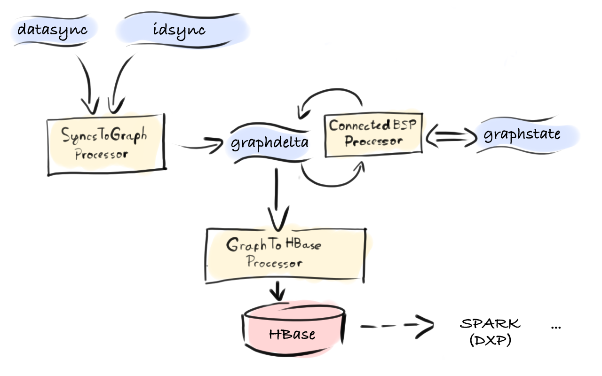

# VisualDNA GraphStream Project

### This is a prototype in two respects:

* Recursive stream processing framework which is included by source and as a project lives [here](https://github.com/michal-harish/donut)
* Streaming BSP equivalent of the Connected Components algorithm implemented in VisualDNA Identity Graph (see [introduction](#intro))

### Contents

1. [Introduction and The Use Case](#intro)
1. [GraphStream Pipeline Architecture](#architecture)
2. [Configuration](#configuration)
3. [Operations](#operations)
4. [Development](#development)

<a name="intro">
## Introduction and Use Case
</a>

### Introduction to Distributed Stream Processing

Stream Processing is a super-abstraction for both real time and batch processing: its primary objectives are throughput and scalability, not low-latency processing, altghouth that becomes an option too. Defined as such it can be seen as a micro-batch processing capable of processing efficiently batches as small as a single record/message and at the same time large backlogs ressembling the batch inputs we're used to with Hadoop and Spark.

Besides the primary objectives it so happens that large stream processing pipelines are a bit easier to reason about and operate in terms of applications ecosystem. Their architecture and infrastructure have a [lot in common with the Unix Philosophy](http://www.confluent.io/blog/apache-kafka-samza-and-the-unix-philosophy-of-distributed-data), i.e. small components with simple functionality composed together by abstract input and output streams, except they add the *distributed* element into the mix - if you're not familiar with the basics of distributed data streams - read about [Kafka]()


### VisualDNA Identity Graph

At VisualDNA, we collect a variety of data, some as near-realtime streams others as large batches coming from partner and customer organsations. All of the datasets contain information about anonymous users and almost each one of them uses a different identifier for the same user. To be able to collate data points about a more real-world looking users, in late 2014 we we started to work on a project called VisualDNA Identity Graph which views a User as a probabilistic entity. User base as a whole evolves over time, and given new information the probabilities that ceratin events belong to the same user change over time, sometimes resulting in re-combining multiple users into one or re-discovering separate user within an existing entity - user is a fleeting concept and as such doesn't have any fixed identifier, we need a graph to represent this reality. Note that this is different from say facebook or twitter graph in that those graphs are built of relationships between users where users have a single deterministic identifier within their respective systems. Here we are looking at graph *possible users*. Our working solution, as shown below, is a set of spark jobs (and spark shell for ad-hoc analysis) used to **ingest**, **process** and **apply** probabilistic connections between identifiers. 


The ingestion consumes connections generated by different machine learning programs which themselves are a topic for another article. Here I'll focus on the architectural style change from batch to stream processing for which we can treat the ingestion as the starting point. So in batch processing, when there is a new **incremental** data set ready to be ingested, we launch a spark job which uses a custom implementation of BSP Connected Components algorithm to iterate over the new dataset in combination with an existing state. In each BSP superstep, the current state which is kept in HBase is combined with the new state for each vertex and all the new connections are propagated to existing edges with diminishing probabilities. This is repeated until a lower bound of probability threshold is reached or all the connections have been propagated. We have also a limit on number of super-steps which is effectively a cap on the maximum degree of connectivity in the graph, which is due to . Not diving in to the spark implementation of BSP I'll only mention that each bsp superstep is done as a *single stage*, which is best you can hope for in a Spark workload. The outcome of any ingestion job is an "update" RDD which is than simply applied on the existing HBase state as a batch operation contain both put and delete instructions.


That means both **ingest** and **process** phases together are responsible for maintaing the current state of the graph which is kept in HBase. This table is then mapped as an RDD where various applications can join it on the data of their particular focus. As a note on spark and hbase integration, an important part of this solution is the concept of map-side or single-stage joins which is described and implemented as a general solution [here](https://github.com/michal-harish/spark-on-hbase).

So in summary, ingetstion Spark jobs update graph state in HBase which is then applied in different contexts by joining or scanning a portion or whole of the graph. The graph ingests about a billion of connections on an average day and some datasets come in in weekly cycles. We have a modest cluster of 32 YARN nodes with total 5TB of memory which is shared by all machine learning, analytical and other workloads besides the graph processing. Some of the ingestion jobs require more than half of the cluster and take between 20 minutes and 2 hours and when something goes wrong it is a painful manual process to get back on track. Large spark workloads, even with optimised serialisation and memory usage as seen with spark-on-hbase graph pose a big resource churn and when failures occur, they are difficult and time consuming to recover from. 

<blockquote>
Most importantly however, Spark and HBase, even with the best co-partitioning model still doesn't take away the I/O churn, plus it is still difficult to have spark partitions deployed automatically on their hbase counterparts. Even in case where hbase partition is on the same node as the spark partition, the overhead seems a bit too large in terms of memory and performance. So while the Spark community is working on the 1.5 release which should see some memory and performance improvements we are looking in the direction of processing data streams without external state, co-located in the consumer process
</blockquote>


### Enter Graph Streaming BSP..

GraphStream is a stream processing pipeline which replaces the **ingest** and **process** phases of the Spark workload described above. At the moment it has an output component which is different from the **apply** phase in the above description. The output here simply offloads the processed graph and continuously writes them to HBase. 
  
If our experiment goes well, we can see that the state kept in HBase could be made completely obsolete, since we now have a constant-time in-memory representation of the graph spread across horizontally scalable processors. We could switch many of the downstream applications to in fact consumer either graphdelta or graphstate streams depending on the particulars but also we could expose the in-memory store of each processor as a simple distributed key-value store mapped onto RDD for analytics in Spark. We'll be looking at this in a near future but for now our streaming replacement for graph ingestion and processing sits on 300Gb of the same YARN cluster using about 70-80 cores. This represents 5% of our computing and memory capacity which is now constantly locked compared to spiky nature of batch jobs. This makes it almost precisely predictible in terms of resources and operationally, the streaming processors deployed in YARN 'feel' a lot more automated and maintainable.

<a name="architecture">
## GraphStream Pipeline Architecture
</a>

<blockquote>
NOTE: As it stands today, we think we could have used the Apache Samza as the processing framework as we have arrived at a nearly identical structure, but our original design how we thought about recursive stream processing was not compatible with Samza constructs and primitives. We will definitely explore this possibility in our next steps as we will be trying to move some of our machine learning algorithms into stream processing paradigm..
</blockquote>

The GraphStream Pipleine starts with syncs collected from Event Trackers or imported from partners and continues through GraphStream Application which processes and generates graph updates which are then off-loaded into HBase where there are mapped and available as Spark RDDs.

The GraphStream Application consists roughly of 3 stages each with one or more components:

1. **Ingest** - ingesting connections into the graph from various sources - two respective BSPMessage(s) are sent representing edge and reverse edge of the connection.

	- **SyncsToGraph** - this is a simple transformation of `datasync` topic to `graphdelta` delta topic 
    
   - **FileToGraph** - used to dump offline syncs into `graphdelta` topic

2. **Process** 

   - **ConnectedBSP** - this is a recursive operator which consumes (and recursively produces into) `graphdelta ` delta topic as well as publishes the new state into the `graphstate` commit log topic.

3. **Output**

   - **GraphToHBase** - this is an incremental compaction operator which consumes graphdelta topic, compacts the changes by the key into micro batches and loads into HBase table dxp-graph




While SyncsToGraph ahd GraphToHBase are simple stream-to-stream filter/map operators, the internal workings of ConnectedBSP requires a more detailed explanation. It also illustrates a general idea of local state in the realm of stream processing, and more specifically also *recurisve stateful stream processing*.

First we need a different kind of topic - a commit log which is supported by Kafka fetaure called [Log  Compaction](https://cwiki.apache.org/confluence/display/KAFKA/Log+Compaction). A topic 'graphstate' in our architecture is log-compacted.


Compacted topic behaves more like a distributed commit log - upon compaction, only the latest entry for any given key is preserved in the log. Now remember that kafka topics are partitioned. And so are the stream procesesors - or their **processing units**. Each processing consumes a fixed number of partitionsm hence the maximum parallelism is defined by the number of partitions in the underlying datastream. Scaling simply means partitioning the stream more, provided that the partitioner used to create the datastreams is deterministic.  In this case our graphdelta and graphstate have 32 partitions and so has our stream processing jobs tasks. So there is 32 instances of the above diagram deployed, each consuming precisely one partition from both graphdelta and graphstate, which are partitioned by the same scheme.  

### but that requires a lot of memory right ?

Yes and no. It is true that these types of jobs are memory-bound rather than I/O bound like is the case in Hadoop or to a large degree in Spark too. And since kafka serves as the disk storage for the commit log, what we really care about in the stream processing units is the CPU and Memory balance. There is always work to be done to find that balance for each application, but fundamentally it is a good place to be in because it promises a true horizontal scalability. Also it turns out that having an embedded local store re-opens all the avenues of memory optimisation that are not available with the external storage systems. We have tried different embedded databases and even tried our own implementation that would suit best the kind of requirements we have at hand. At the moment we are experimienting with something that behaves similarly to a compacted data stream but is mutable and has a hash index for constant time access. More importantly it doesn't rely on JVM garbage collector but manages the space in respect to the nature of the data stream - it has a hot and cold segments.


Having a precise control over how memory is managed combined with efficient serialisation of the records results in suprisingly small memory footprint than anticipated from the experience with the Spark equivalent. 

Now depending on nature of keys and the data there is a certain optimum size of each processing unit in terms of memory too which again has to be found by operating the system in production. For example, our graph contains dozens of different identifier types some of which are UUID etc. This creates a very large overhead for maintaining the hash table for each local store so we found that having rather large memory allocated to a smaller number of tasks saves some memory but is slower so our optimum is at the moment 32 tasks each with 6Gb direct memory dedicated to the local store. Under a fully caught-up conditions 1.2Gb of those 6 is occupied by the index which is not optimal but we know we will be scaling the size of the input soon where we may have to double this capacity to 12Gb per task which will make the index-to-data ratio roughly 1:12 which starts to look better. 
<hr/>
So the bottom line of the memory question, is that the state is local to the process, a lot of optimisations can be done which are not possible with external storage, and the option to fully control how much memory is used and how is it managed gives us a direct way to answer questions about resource planning or cost justifications, i.e. "how big window of data do we need to keep all the applications satisfied" or "how much more cluster power and memory do we need if we were to double the input data to the graph".

<a name="configuration">
## Configuration
</a>

Because the application is launched normally in the YARN cluster but *from a client machine*, in the application configuration (typially placed in **/etc/vdna/graphstream/config.properties**) you need `yarn1.site` parameter to point to your local hadoop-yarn configuration files, which in this example are expected to be in **/opt/envs/prod/etc/hadoop**. This configuration can be used on developer macs for launching from IntelliJ (see bleow) or Jenkins or other starting points.

```
#YARN 
yarn1.site=/opt/envs/prod/etc/hadoop
yarn1.classpath=/opt/scala/scala-library-2.11.5.jar:/opt/scala/kafka_2.11-0.8.2.1.jar:/usr/lib/hbase/*:/usr/lib/hbase/lib/htrace-core-3.1.0-incubating.jar:/usr/lib/hbase/lib/guava-12.0.1.jar:/usr/lib/hbase/lib/netty-all-4.0.23.Final.jar
yarn1.queue=developers
#J-PROFILER
#yarn1.env.LD_PRELOAD=/opt/jprofiler/librebind.so
#yarn1.env.REBIND_PORT=8849:0
#KAFKA 
zookeeper.connect=message-01.prod.visualdna.com,message-02.prod.visualdna.com,message-03.prod.visualdna.com
kafka.brokers=message-01.prod.visualdna.com:9092,message-02.prod.visualdna.com:9092,message-03.prod.visualdna.com:9092
#HBASE
hbase.site=/etc/hbase/conf.prod
```

NOTE: The `yarn1.classpath` means that we have already distributed large fat jars of scala-library and kafka so that we can have them here provided and distribute only a relatively thin jar each time we create a YARN launch context.

<a name="operations">
## Operations
</a>

### Packaging components and submitting them to YARN cluster
```
mvn clean package
```
The maven command above will generate an assembly jar for all components: `targets/SyncsToGraph-0.9.jar` and a `./submit` which can be used as follows:  

```
./submit net.imagini.dxp.graphstream.connectedbsp.ConnectedBSP /etc/vdna/graphstream/config.properties
```

OR

```
./submit net.imagini.dxp.graphstream.ingest.SyncsToGraph /etc/vdna/graphstream/config.properties
```

### YARN resources

The prototype was built on a modest cluster of **3 kafka brokers** with both `graphdelta` and `graphstate` topics having **32 partitions**.
When all 3 components, the application requires **310 GB of memory** across **76 YARN containers**. Most of the memory
is occupied byt the local state of the ConnectedBSP component, cca **256 GB** which covers enough to keep around 30 days of the connected graph state.


### Brokers configuration
For state topics we require log cleaner enabled on the brokers

```server.properties
log.cleaner.enable=true
```

### Creating normal topics with retention

```bash
./bin/kafka-topics.sh --zookeeper <zkconnect> --create --topic graphdelta --partitions 32 --replication-factor 1 --config cleanup.policy=delete --config retention.bytes=2147483648 
```

### Creating a compacted topic with some special behaviours
And then creating topic with compact cleanup policy
```bash
./bin/kafka-topics.sh --zookeeper <zkconnect> --create --topic graphstate --partitions 32 --replication-factor 1 --config cleanup.policy=compact --config min.cleanable.dirty.ratio=0.2 --config delete.retention.ms=0 
```

Altering the topic to practically ignore the tombstone retention ..10 minutes from default 24 hours
```
./bin/kafka-topics.sh --zookeeper <zkconnect> --alter --topic graphstate --config delete.retention.ms=0
```

### Deleting topics

```bash
./bin/kafka-topics.sh --zookeeper <zkconnect> --delete --topic graphdelta
./bin/kafka-topics.sh --zookeeper <zkconnect> --delete --topic graphstate
```


<a name="development">
## Development
</a>
### Configuring IntelliJ and Maven 

The GraphStream project has a direct source dependencies which are not standard maven pom-declared dependencies
 but are pulled in as git submodules. This way it is possible rapidly develop the underlying Donut and Yarn1 frameworks
 which are still unstable. 

```
graphstream.git (stash.visualdna.com)
     |
     +-- donut.git  (github.com/michal-harish/donut)
            |
            +-- yarn1.git (github.com/michal-harish/yarn1)
```

So in order to be able to clone and initialise the codebase you'll need a github account and ssh keys of your
development machine to be added there. If you want to commit to the Donut or Yarn1 ask MH to add your ssh keys
to the projects. So after that you can clone the graphstream repo and initialise the submodules:

```
git clone git@stash.visualdna.com:7999/dxp/graphstream.git
cd graphstream
git submodule update --init
cd donut
git submodule update --init
cd ..
```

If you look at the `pom.xml` you'll see a section for `build-helper-maven-plugin` adding the submodule sources:

```
...
<source>donut/yarn1/src/main/java</source>
<source>donut/core/src/main/scala</source>
...
```

This works fine with `mvn` command but unfortunately even the most recent version of IntelliJ still doesn't support build-helper pluging so in order for IntelliJ to see the sources you need to add them manually, once:

* ⌘ Project Structure >
	* donut/core/src/main/scala > right click `source`
	* donut/yarn1/src/main/java > right click `source`

By default, IntelliJ should preserve these added folders on re-import but in case it doesn't:

* ⌘ Preferences > 
	* Build, Excecution, Deployment > Build Tools > Maven > Importing
  		* check 'Keep source and test folders on reimport'


### Launching the application from IntelliJ

For launching the application from within the IntelliJ runtime there are several starting points all which are located in the *test* source net.imagini.dxp.graphstream.Launchers.scala.
The reason for the test package is that many dependencies are provided and not available without hadoop/yarn environment but provided scope is available in the maven test phase. There are two components(see [architecture](#architecture) above) and each has 2 different launchers:

1. YarnLaunch - submits the application to the YARN cluster and waits for completion printing any progress - stopping the application will attempt to kill the yarn context as well from the shutdown hook
2. LocalLaunch - is for debugging and doesn't actually submit the application to yarn and all streaming and processing happens locally

### TODOs  
- Edges should not be represented as Map[Vid, EdgeProps] but rather Set[Edge] where Edge object would contain the dest Vid to allow for duplicate connections with different properties 
- SyncsToGraph could have a small-ish local state for short window memstore for better detection of bad data, robots, etc.  


